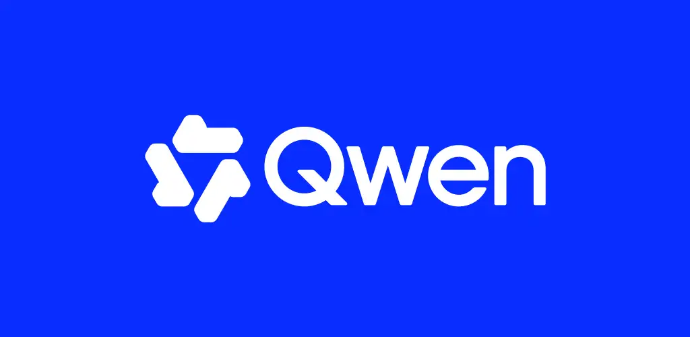
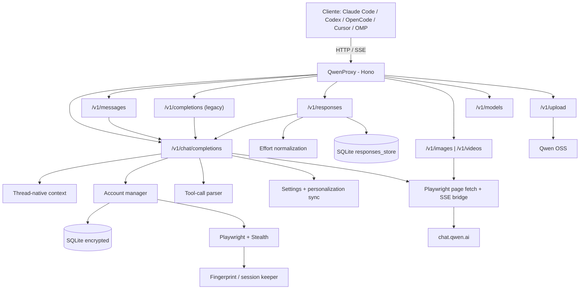

<p align="center">
  
</p>

<p align="center">
  <a href="README.md">English</a> ·
  <a href="README.pt-BR.md">Português</a> ·
  <b>Español</b>
</p>

Gateway y API de alto rendimiento compatible con **OpenAI** y **Anthropic** que conecta clientes y agentes de programación (Claude Code CLI, OpenAI Codex, OpenCode, Cursor, OMP, Zed, Grok) con **Qwen (`chat.qwen.ai`)** con rotación multi-cuenta, failover inteligente, llamada de herramientas (tool calling) robusta, ejecución delta nativa, generación de imágenes y vídeos, **Responses API completa de OpenAI con memoria persistente** y sesiones duraderas. Desarrollado con Chromium headless stealth, reintentos ante errores transitorios, variantes públicas base/`-fast`/`-thinking`, caché comprimida, registro dinámico de capacidades por modelo y observabilidad completa.

[](https://github.com/johngbl/QwenProxy/actions/workflows/ci.yml)
[](https://www.npmjs.com/package/qwenproxy-cli)
[](https://www.typescriptlang.org/)
[](https://hono.dev/)
[](https://github.com/kaliiiiiiiiii/patchright)
[](LICENSE)
[](https://github.com/sponsors/johngbl)
[](https://ko-fi.com/johngbl)

## ❤️ Apoya el Proyecto

Si **QwenProxy** te resulta útil a ti o a tu equipo y deseas apoyar el desarrollo continuo, nuevas integraciones, pruebas en vivo y actualizaciones rápidas, considera un patrocinio voluntario:

<a href="https://github.com/sponsors/johngbl" target="_blank"></a> <a href="https://ko-fi.com/johngbl" target="_blank"></a>

¡Toda contribución ayuda a cubrir costes de infraestructura, ancho de banda y cuentas de prueba!

---

## 🚀 Características Principales

- **Compatibilidad Nativa con OpenAI y Anthropic** — `/v1/chat/completions`, `/v1/models`, `/v1/messages` (**Anthropic Messages API nativa** para **Claude Code CLI** y SDK oficial), `/v1/messages/count_tokens`, **OpenAI Responses API** (`/v1/responses`) y `/v1/completions` (adaptador heredado).
- **Matriz Completa de 4 Modos de Conversación** — `thread` (predeterminado persistente), `thread-temp` (delta ~1KB efímero, recomendado para agentes), `stateless-temp` (estándar oficial OpenAI, efímero) y `stateless` (estándar oficial OpenAI, guardado en la cuenta web).
- **Control Dinámico de Modos en Tiempo Real** — Cambia el modo global de la API al instante mediante la TUI (tecla `M` en estado o `F4` en Chat) o a través del endpoint `/v1/chat/mode`, sin reiniciar el proxy.
- **Dashboard TUI Completo en Terminal (`qpx`)** — Interfaz visual con soporte completo para ratón (hover, clic, arrastrar y scroll), selectores verticales de modelos y modos, y título de ventana nativo `QwenProxy`.
- **Importación de Cuentas por Lotes (`B`)** — Pega decenas de cuentas a la vez (`email:contraseña`, formato `.env`, tabulación o barra vertical). Cifrado en reposo en una única transacción SQLite (<10ms) con deduplicación y conteo en tiempo real.
- **Desplazamiento Dinámico de Viewport** — Navegación fluida en listas de más de 50 cuentas sin desbordar el terminal ni desalinear columnas.
- **Sincronizador Automático de Clientes (`qpx sync`)** — Configuración en 1 clic para Claude Code, OpenAI Codex, OpenCode, Cline, OMP, Zed, Kilo Code y Hermes con copia de seguridad y restauración.
- **Instancia Única de Chromium Ultra-Ligera** — 1 solo proceso de navegador con aceleración WebGL y contextos aislados (`BrowserContext`) con persistencia ligera de sesiones (~200MB de RAM para todas las cuentas, ahorro >65%).
- **Inicio Bajo Demanda y Pool Multi-Cuenta** — Arranca instantáneamente con la **primera cuenta lista**; las cuentas de reserva permanecen en *Standby* e inicializan solo cuando se necesitan (failover o rotación).
- **Sincronización de Personalización Limpia** — Las instrucciones del sistema y herramientas se sincronizan directamente en la personalización de la cuenta (`/settings/personalization`), imitando al cliente web real y evitando bloqueos de WAF/bots.
- **Parser de Tool Calling con Auto-Reparación** — Tolera streams fragmentados, repara JSON roto, etiquetas unificadas `<qpx_call>`, coincidencias difusas de nombres (`readFile` → `read_file`) y reintentos automáticos.
- **Generación de Imágenes y Vídeos** — Endpoints dedicados `/v1/images/generations` y `/v1/videos/generations` con modelos de vanguardia (`qwen-image-3.0-pro`, `wan3.0-video`, `wan2.7-image-pro`).
- **Observabilidad y Monitorización** — Estado en tiempo real en `/health`, `/metrics` (Prometheus), watchdog de memoria RSS y registros unificados por turno.

---

## 🏛️ Arquitectura



---

## 🔄 Modos de Conversación

QwenProxy ofrece una matriz completa de **4 modos de operación**, permitiendo balancear el consumo de tokens, la latencia y la organización del historial:

| Modo | Estrategia de Envío | Modo Upstream Qwen | ¿Se Guarda en la Web? | Caso de Uso Recomendado |
| :--- | :--- | :--- | :---: | :--- |
| **`thread-temp`** ⭐ | **Delta (~1KB)** | `chat_mode: "local"` | ❌ No (Cero basura) | **El mejor para el trabajo diario.** Recomendado para Claude Code, Codex, OpenCode y Cursor. Máxima velocidad, TTFB ultrabajo y sin saturar tu historial en `chat.qwen.ai`. |
| **`stateless-temp`** | **Historial Completo** | `chat_mode: "local"` | ❌ No (Cero basura) | **Estándar Oficial de APIs (OpenAI/Anthropic).** Reenvía todo el historial en cada turno. Ideal si tu cliente edita, poda o reorganiza mensajes pasados durante la sesión. |
| **`thread`** *(Predeterminado)* | **Delta (~1KB)** | `chat_mode: "normal"` | ✅ Sí (Guardado en la web) | Perfecto si deseas revisar o continuar la conversación más tarde desde el móvil o navegador en la web oficial de Qwen. |
| **`stateless`** | **Historial Completo** | `chat_mode: "normal"` | ✅ Sí (Guardado en la web) | Reenvía el historial completo en cada turno y mantiene guardadas todas las conversaciones en tu cuenta de Qwen. |

### Cómo cambiar de modo:

1. **Desde la TUI Interativa (En Tiempo Real Global):**
   - **En la pantalla `[1] Status`:** Pulsa la tecla **`M`** (o haz clic en `[ M ] Alternar Modo`) para rotar el modo global de la API al instante.
   - **En la pantalla `[2] Chat`:** Pulsa **`F4`** (o haz clic en `[ Modo ]`) para abrir el selector vertical.
2. **Mediante Endpoint HTTP Remoto:**
   ```bash
   # Consultar modo activo:
   curl http://127.0.0.1:7936/v1/chat/mode

   # Actualizar modo globalmente en tiempo real:
   curl -X POST http://127.0.0.1:7936/v1/chat/mode \
     -H "Content-Type: application/json" \
     -d '{"mode":"thread-temp"}'
   ```
3. **Por Petición Individual (Header HTTP):**
   Envía la cabecera `X-QwenProxy-Chat-Mode: thread-temp` (o `stateless-temp`, `thread`, `stateless`).
4. **En el archivo `.env` (Valor de Arranque):**
   ```env
   QWEN_CHAT_MODE=thread
   ```

---

## 📖 Paso a Paso: Cómo Empezar desde Cero

### 1. Instalación

Instala el CLI de QwenProxy globalmente en tu sistema:

```bash
# Vía npm:
npm install -g qwenproxy-cli

# O vía pnpm / bun:
pnpm add -g qwenproxy-cli
# bun add -g qwenproxy-cli
```

### 2. Iniciar el Dashboard Interactivo (TUI)

Abre tu terminal y ejecuta:

```bash
qpx
```

QwenProxy iniciará el servidor proxy en segundo plano y abrirá el panel interactivo. El título de la ventana del terminal se establecerá automáticamente como **`QwenProxy`**.

### 3. Añadir Cuentas de Qwen

Dentro de la TUI, dirígete a la pestaña **`[5] Contas`** para gestionar credenciales:

- **Importación por Lotes (`B`):** Pulsa **`B`** (o haz clic en `[ B ] Em Lote`). Pega tus credenciales en masa (`email:contraseña` por línea, formato `.env` con comas o copiado de hojas de cálculo). El sistema calcula las cuentas válidas en tiempo real, respeta caracteres especiales en contraseñas, omite duplicadas y guarda todo cifrado en SQLite en una sola transacción (<10ms).
- **Cuenta Individual (`A`):** Pulsa **`A`** para escribir manualmente email y contraseña.
- **Login Visual en Navegador:** Si prefieres iniciar sesión visualmente con resolución manual de captcha: `qpx login`.

### 4. Sincronizar Agentes de Programación

Para configurar automáticamente tus herramientas para que usen QwenProxy:

```bash
# Sincroniza todos los agentes detectados en tu máquina:
qpx sync

# O sincroniza agentes específicos:
qpx sync claude codex opencode
```

El sincronizador configura de forma transparente:
- **Claude Code CLI** (`~/.claude/settings.json`) — Protocolo nativo Anthropic (`/v1/messages`).
- **OpenAI Codex CLI** (`~/.codex/config.toml`) — Protocolo nativo Responses (`/v1/responses`).
- **OpenCode** (`~/.config/opencode/opencode.jsonc`) — Proveedor compatible con OpenAI.
- **Cline, OMP, Zed, Kilo Code y Hermes Agent**.
> **Consejo de Restauración:** Puedes restaurar las configuraciones originales en cualquier momento ejecutando `qpx sync --restore` (o `npm run sync:restore`).
### 5. ¡Listo para Programar!

Ejecuta tu agente favorito con total normalidad:
```bash
# Ejecutar Claude Code:
claude

# Ejecutar Codex CLI:
codex

# Ejecutar OpenCode:
opencode
```
¡Todas las consultas y llamadas a herramientas funcionarán a máxima velocidad, sin costes de APIs externas y con rotación automática de cuentas!

---

## 💡 Consejos de Producción y Buenas Prácticas

1. **Usa `thread-temp` para Programar a Diario:**  
   Los agentes de código generan decenas de turnos y llamadas a herramientas por minuto. Trabajar en `thread-temp` evita que cientos de chats temporales saturen tu cuenta personal en `chat.qwen.ai`, manteniendo un TTFB constante de ~0.6s a 1.2s.
2. **Múltiples Cuentas y Cuota Diaria (00:00 UTC):**  
   Configura 2 o más cuentas. Las cuotas diarias de Qwen Web se reinician puntualmente a las **00:00 UTC**. Cuando una cuenta alcanza el límite, el proxy la pone en cooldown y pasa de inmediato a la siguiente cuenta saludable.
3. **Limpieza Periódica de Perfiles (`qpx clean`):**  
   Con el uso continuo, Chromium acumula cachés de V8 y GPU. Ejecuta `qpx clean` para purgar cachés prescindibles, reduciendo el tamaño de cada perfil de ~300MB a solo **~4.5MB por cuenta**, manteniendo intactas las cookies y sesiones.
4. **Reinicio Inmediato de Cooldowns:**  
   Para desbloquear cuentas en cooldown inmediatamente, pulsa **`Z`** en la pantalla `[1] Status` o ejecuta `qpx reset`.

---

## 📦 Modelos y Capacidades

Los modelos y ventanas de contexto se sincronizan dinámicamente desde el catálogo oficial `/api/models` de Qwen para cada cuenta:

| Modelo | Ventana de Contexto | Salida Máxima | Thinking | Vision |
| :--- | :---: | :---: | :---: | :---: |
| `qwen3.8-max` | 1.000.000 | 131.072 | ✅ Sí | ✅ Sí |
| `qwen3.7-plus` | 1.000.000 | 65.536 | ✅ Sí | ✅ Sí |
| `qwen3.7-max` | 1.000.000 | 65.536 | ✅ Sí | ❌ No |
| **Fallback** | **1.048.576** | **65.536** | — | — |

### Variantes Sintéticas

- Modelo Base — **Modo Auto** (Qwen decide cuándo razonar), ej.: `qwen3.8-max`
- `-fast` — Razonamiento desactivado para respuestas ultrarrápidas, ej.: `qwen3.8-max-fast`
- `-thinking` — Razonamiento forzado, ej.: `qwen3.8-max-thinking`

---

## 🛠️ Comandos del CLI y Scripts NPM

| Comando | Descripción |
| :--- | :--- |
| `qpx` *(o `npm run tui`)* | Abre el dashboard TUI con servidor integrado |
| `qpx start` *(o `npm start`)* | Inicia solo el servidor HTTP/SSE en modo headless (sin interfaz) |
| `qpx sync` *(o `npm run sync`)* | Sincroniza agentes (Claude Code, Codex, OpenCode, Cline, OMP) |
| `qpx clean` | Purga cachés temporales de Chromium (~4.5MB por cuenta) |
| `qpx clean:all` | Purga cachés y elimina navegadores obsoletos en disco (~4GB) |
| `qpx reset` | Restablece cooldowns y límites de tasa en la base de datos |
| `qpx login` | Autentica nuevas cuentas visualmente mediante navegador |
| `qpx purge` | Elimina el historial remoto de chats en las cuentas configuradas |
| `qpx update` | Actualiza QwenProxy automáticamente a la última versión |
| `npm test` | Ejecuta la suite completa de pruebas (mock y en vivo) |
| `npm run typecheck` | Verificación estricta de tipos de TypeScript (cero errores) |

---

## 🐳 Despliegue con Docker

```yaml
services:
  qwenproxy:
    build: .
    container_name: qwenproxy
    ports:
      - "${PORT:-7936}:7936"
    env_file:
      - .env
    volumes:
      - ./data:/app/data
    restart: unless-stopped
    shm_size: "2gb"
    logging:
      driver: "json-file"
      options:
        max-size: "10m"
        max-file: "3"
```

---

## ⚖️ Descargo de Responsabilidad (Disclaimer)

**Este software se proporciona "tal cual", sin garantía de ningún tipo, expresa o implícita.**

- **Sin Afiliación:** QwenProxy es un proyecto independiente de código abierto y no está afiliado, respaldado ni patrocinado por Alibaba, Qwen, OpenAI, Anthropic ni ningún proveedor mencionado.
- **Uso Educativo y Personal:** Diseñado para investigación técnica y desarrollo local. Los usuarios son los únicos responsables de cumplir con los Términos de Servicio del proveedor, gestionar sus propias credenciales y cumplir con las leyes aplicables.
- **Responsabilidad del Usuario:** El usuario asume toda la responsabilidad por límites de tasa, desafíos de seguridad y contenido generado.

Desarrollado y mantenido por **johngbl**, construido sobre las bases de código abierto desarrolladas originalmente por **Pedro Farias** bajo la [Licencia ISC](LICENSE).
