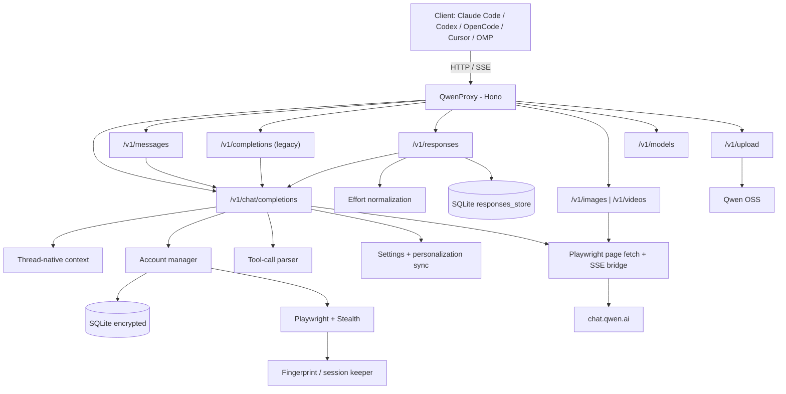

<p align="center">
  
</p>

<p align="center">
  <b>English</b> ·
  <a href="README.pt-BR.md">Português</a> ·
  <a href="README.es.md">Español</a>
</p>

High-performance OpenAI- and Anthropic-compatible API gateway that bridges modern AI coding agents and clients (Claude Code CLI, OpenAI Codex, OpenCode, Cursor, OMP, Zed, Grok) to **Qwen (`chat.qwen.ai`)** with multi-account rotation, intelligent failover, robust tool calling, thread-native delta execution, image & video generation, **full OpenAI Responses API with persistent memory**, and durable sessions. Powered by stealth headless Chromium, transient retry ladders, public base/`-fast`/`-thinking` variants, compressed caching, dynamic model capability registry, and full observability.

[](https://github.com/johngbl/QwenProxy/actions/workflows/ci.yml)
[](https://www.npmjs.com/package/qwenproxy-cli)
[](https://www.typescriptlang.org/)
[](https://hono.dev/)
[](https://github.com/kaliiiiiiiiii/patchright)
[](LICENSE)
[](https://github.com/sponsors/johngbl)
[](https://ko-fi.com/johngbl)

## ❤️ Support the Project

If **QwenProxy** is helping you or your team and you would like to support continuous maintenance, new client integrations, live probes, and rapid upstream patches, consider voluntary sponsorship:

<a href="https://github.com/sponsors/johngbl" target="_blank"></a> <a href="https://ko-fi.com/johngbl" target="_blank"></a>

Every contribution helps cover infrastructure costs, proxy bandwidth, and test accounts!

---

## 🚀 Key Features

- **Native OpenAI & Anthropic Compatibility** — `/v1/chat/completions`, `/v1/models`, `/v1/messages` (**native Anthropic Messages API** for **Claude Code CLI** and official `@anthropic-ai/sdk`), `/v1/messages/count_tokens`, **OpenAI Responses API** (`/v1/responses`), and `/v1/completions` (legacy adapter).
- **Full 4-Mode Conversation Matrix** — `thread` (default persistent), `thread-temp` (delta ~1KB ephemeral, recommended for coding agents), `stateless-temp` (OpenAI official stateless standard, ephemeral), and `stateless` (OpenAI official stateless standard, saved to web account).
- **Real-Time Dynamic Mode Switching** — Switch the global proxy API mode instantly via TUI (`M` on the status screen or `F4` in Chat) or via `/v1/chat/mode` HTTP endpoint, without restarting the server.
- **Full Terminal Dashboard TUI (`qpx`)** — Interactive monospace UI with full mouse support (hover, click, drag, and scroll), vertical model/mode selectors, and native `QwenProxy` terminal window title.
- **Batch Account Import (`B`)** — Paste dozens of accounts in seconds (`email:password`, `.env` format, tab, pipe). Stored with at-rest encryption in a single SQLite transaction (<10ms) with deduplication and live count badges.
- **Dynamic Viewport Scrolling** — Smooth list navigation across 50+ accounts without layout overflow or column misalignment.
- **1-Click Coding Agent Sync (`qpx sync`)** — Automated setup for Claude Code, OpenAI Codex, OpenCode, Cline, OMP, Zed, Kilo Code, and Hermes with 1-click backup rollback.
- **Ultra-Light Single Chromium Instance** — 1 shared browser process with hardware WebGL acceleration and isolated `BrowserContext` storage states (~200MB RAM across all accounts, >65% resource reduction).
- **On-Demand Warmup & Multi-Account Pool** — Boots instantly with the **primary account ready**; standby accounts remain idle and warm up lazily on demand (during failover or rotation).
- **Clean Personalization Synchronization** — System prompts and tools ride account personalization (`/settings/personalization`), mirroring the official web client and avoiding WAF bot triggers.
- **Self-Healing Tool Call Parser** — Handles fragmented streams, broken JSON parameters, unified `<qpx_call>` tags, fuzzy name matching (`readFile` → `read_file`), and intelligent auto-retry ladders.
- **Image & Video Generation** — Dedicated `/v1/images/generations` and `/v1/videos/generations` endpoints with flagship models (`qwen-image-3.0-pro`, `wan3.0-video`, `wan2.7-image-pro`).
- **Observability & Health Monitoring** — Real-time metrics at `/health`, `/metrics` (Prometheus), RSS watchdog, and unified clean log pairs per turn.

---

## 🏛️ Architecture



---

## 🔄 Conversation Modes

QwenProxy provides a complete matrix of **4 conversation modes**, letting you choose the exact balance between token efficiency, latency, and history organization:

| Mode | Payload Strategy | Upstream Qwen Mode | Saved to Web Account? | Recommended Use Case |
| :--- | :--- | :--- | :---: | :--- |
| **`thread-temp`** ⭐ | **Delta (~1KB)** | `chat_mode: "local"` | ❌ No (Zero pollution) | **The best mode for daily development.** Recommended for Claude Code, Codex, OpenCode, and Cursor. Maximum speed, ultra-low TTFB, and zero sidebar clutter on `chat.qwen.ai`. |
| **`stateless-temp`** | **Full History** | `chat_mode: "local"` | ❌ No (Zero pollution) | **Official API Standard (OpenAI/Anthropic).** Resends full message history on every turn. Ideal if your client edits, prunes, or re-orders past turns mid-session. |
| **`thread`** *(Default)* | **Delta (~1KB)** | `chat_mode: "normal"` | ✅ Yes (Saved to web) | Perfect if you want to inspect or continue your agent's conversation later directly inside the official `chat.qwen.ai` mobile app or desktop browser. |
| **`stateless`** | **Full History** | `chat_mode: "normal"` | ✅ Yes (Saved to web) | Resends full message history on every turn while persisting every chat session into your Qwen account history. |

### How to Switch Modes:

1. **Via Interactive TUI (Real-Time Global Switch):**
   - **On `[1] Status` screen:** Press **`M`** (or click `[ M ] Alternar Modo`) to cycle the global API mode instantly.
   - **On `[2] Chat` screen:** Press **`F4`** (or click the `[ Modo ]` header button) to open the vertical modal selector.
2. **Via Remote HTTP Endpoint:**
   ```bash
   # Inspect active mode:
   curl http://127.0.0.1:7936/v1/chat/mode

   # Update mode globally in real time:
   curl -X POST http://127.0.0.1:7936/v1/chat/mode \
     -H "Content-Type: application/json" \
     -d '{"mode":"thread-temp"}'
   ```
3. **Per-Request Header Override:**
   Send `X-QwenProxy-Chat-Mode: thread-temp` (or `stateless-temp`, `thread`, `stateless`) in individual HTTP requests.
4. **Via `.env` Configuration (Boot Default):**
   ```env
   QWEN_CHAT_MODE=thread
   ```

---

## 📖 Step-by-Step: Getting Started

### 1. Installation

Install the QwenProxy CLI globally on your workstation:

```bash
# Via npm:
npm install -g qwenproxy-cli

# Or via pnpm / bun:
pnpm add -g qwenproxy-cli
# bun add -g qwenproxy-cli
```

### 2. Launch the Interactive Dashboard (TUI)

Open your terminal and run:

```bash
qpx
```

QwenProxy launches the high-performance proxy server in the background and opens the interactive dashboard. The terminal window title will automatically update to **`QwenProxy`**.

### 3. Add Qwen Accounts

Inside the TUI, navigate to tab **`[5] Accounts`** to manage credentials:

- **Batch Import (`B`):** Press **`B`** (or click `[ B ] Em Lote`). Paste your account credentials in bulk (`email:password` per line, raw `.env` string with commas, or spreadsheet paste). The parser calculates valid accounts in real time, handles special password characters safely, skips duplicates, and commits encrypted credentials to SQLite in a single transaction (<10ms).
- **Single Account (`A`):** Press **`A`** to manually type email and password.
- **Browser Login:** If you prefer visual login with manual captcha solving: `qpx login`.

### 4. Synchronize AI Coding Agents

To automatically configure your installed coding agents to route through QwenProxy:

```bash
# Automatically sync all detected agents:
qpx sync

# Or target specific agents:
qpx sync claude codex opencode
```

The synchronizer configures:
- **Claude Code CLI** (`~/.claude/settings.json`) — Native Anthropic protocol (`/v1/messages`).
- **OpenAI Codex CLI** (`~/.codex/config.toml`) — Native Responses protocol (`/v1/responses`).
- **OpenCode** (`~/.config/opencode/opencode.jsonc`) — OpenAI-compatible provider.
- **Cline, OMP, Zed, Kilo Code, and Hermes Agent**.

> **Rollback tip:** Restore previous client configuration backups anytime with `qpx sync -- --restore`.

### 5. Start Coding!

Launch your favorite coding tool as you normally would:
```bash
# Run Claude Code:
claude

# Run Codex CLI:
codex

# Run OpenCode:
opencode
```
All completions and tool calls will flow through your local QwenProxy gateway with zero external API fees, high context windows, and automatic multi-account rotation!

---

## 💡 Production Tips & Best Practices

1. **Use `thread-temp` for Agentic Coding Work:**  
   Coding agents generate dozens of turns and tool calls per minute. Running in `thread-temp` keeps your Qwen account clean while delivering blazing-fast ~0.6s–1.2s TTFB.
2. **Multi-Account Quota Reset (00:00 UTC):**  
   Configure 2 or more accounts. Qwen Web daily quotas reset strictly at **00:00 UTC**. When an account reaches its limit, the proxy parks it until midnight and seamlessly promotes the next healthy standby account.
3. **Profile Disk Pruning (`qpx clean`):**  
   Over time, Chromium contexts accumulate transient V8 and GPU caches. Run `qpx clean` to shrink profiles from ~300MB down to **~4.5MB per account**, while preserving cookies and authenticated sessions intact.
4. **Instant Cooldown Reset:**  
   To immediately unpark accounts on cooldown, press **`Z`** on the `[1] Status` screen or run `qpx reset`.

---

## 📦 Models & Capabilities

Models and context windows are synchronized dynamically from Qwen's live `/api/models` catalog per account. Capabilities and metadata are resolved automatically:

| Model | Context Window | Max Output | Thinking | Vision |
| :--- | :---: | :---: | :---: | :---: |
| `qwen3.8-max` | 1,000,000 | 131,072 | ✅ Yes | ✅ Yes |
| `qwen3.7-plus` | 1,000,000 | 65,536 | ✅ Yes | ✅ Yes |
| `qwen3.7-max` | 1,000,000 | 65,536 | ✅ Yes | ❌ No |
| **Fallback** | **1,048,576** | **65,536** | — | — |

### Synthetic Variants

- Base Model — **Auto mode** (Qwen decides whether to reason), e.g.: `qwen3.8-max`
- `-fast` — Thinking disabled for rapid generation, e.g.: `qwen3.8-max-fast`
- `-thinking` — Thinking forced ON, e.g.: `qwen3.8-max-thinking`

### `reasoning_effort` Parameter

Standard OpenAI `reasoning_effort` values (`low`, `medium`, `high`) are supported:
- `low` / `none` → forces Fast mode (thinking OFF).
- `medium` / `high` / `max` → enables thinking.

---

## 🌐 Supported Endpoints

### OpenAI Compatible
| Endpoint | Method | Description |
| :--- | :---: | :--- |
| `/v1/chat/completions` | POST | Chat completions (streaming & non-streaming) |
| `/v1/chat/completions/stop` | POST | Abort an active generation |
| `/v1/chat/mode` | GET / POST | Inspect or update the global conversation mode in real time |
| `/v1/models` | GET | List available models and capabilities |
| `/v1/models/:id` | GET | Model details |
| `/v1/responses` | POST | Full OpenAI Responses API with persistent memory |
| `/v1/responses/:id` | GET / DELETE | Retrieve or delete stored response context |
| `/v1/completions` | POST | Legacy completions adapter |

### Anthropic Compatible
| Endpoint | Method | Description |
| :--- | :---: | :--- |
| `/v1/messages` | POST | Native Anthropic Messages API (Claude Code CLI, SDK) |
| `/v1/messages/count_tokens` | POST | Token counting endpoint |

### Media Generation (Images & Videos)
| Endpoint | Method | Description |
| :--- | :---: | :--- |
| `/v1/images/generations` | POST | Image generation (`qwen-image-3.0-pro`, `wan2.7-image-pro`) |
| `/v1/videos/generations` | POST | Video generation (`wan3.0-video` up to 1080P, `wan2.7-t2v`) |
| `/v1/tasks/status/:taskId` | GET | Check asynchronous video task progress |

### Diagnostics & Monitoring
| Endpoint | Method | Description |
| :--- | :---: | :--- |
| `/health` | GET | System health check and active stream metrics |
| `/metrics` | GET | Prometheus exposition |
| `/v1/upload` | POST | Multimodal asset upload |

---

## 🛠️ CLI Commands & NPM Scripts

| Command | Description |
| :--- | :--- |
| `qpx` *(or `npm run tui`)* | Open interactive TUI dashboard with integrated server |
| `qpx start` *(or `npm start`)* | Start headless proxy server (no UI) |
| `qpx sync` *(or `npm run sync`)* | Auto-configure coding agents (Claude Code, Codex, OpenCode, Cline, OMP) |
| `qpx clean` | Prune transient Chromium profile caches (~4.5MB per account) |
| `qpx clean:all` | Reclaim disk space from obsolete browser downloads (~4GB) |
| `qpx reset` | Reset rate-limit and error cooldowns in database |
| `qpx login` | Authenticate new accounts via visible browser |
| `qpx purge` | Delete remote chat history across configured accounts |
| `qpx update` | Automatically update QwenProxy to the latest version |
| `npm test` | Run complete test suite (mock & live suites) |
| `npm run typecheck` | Strict TypeScript verification (0 errors required) |

---

## 🐳 Docker Deployment

```yaml
services:
  qwenproxy:
    build: .
    container_name: qwenproxy
    ports:
      - "${PORT:-7936}:7936"
    env_file:
      - .env
    volumes:
      - ./data:/app/data
    restart: unless-stopped
    shm_size: "2gb"
    logging:
      driver: "json-file"
      options:
        max-size: "10m"
        max-file: "3"
```

---

## ⚖️ Disclaimer

**This software is provided "as is", without warranty of any kind, express or implied.**

- **No Affiliation:** QwenProxy is an independent open-source project and is not affiliated with, endorsed, or sponsored by Alibaba, Qwen, OpenAI, Anthropic, or any mentioned provider.
- **Educational & Personal Use:** Intended for technical research and local development. Users are solely responsible for adhering to upstream Terms of Service, managing their own credentials, and complying with applicable laws.
- **User Responsibility:** The user assumes full responsibility for account rate limits, security challenges, and content generated.

Developed and maintained by **johngbl**, built on open-source foundations originally authored by **Pedro Farias** under the [ISC License](LICENSE).
